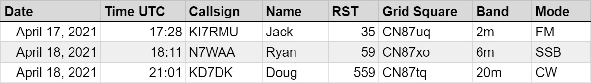

# PSRG QSO Party

The **PSRG QSO Party** is a month-long event to encourage contact between members of the Puget Sound Repeater Group outside of nets and without the use of the repeater, thereby practicing and promoting the radio art and building our community.

**The PSRG QSO Party will begin on June 1st, 0000 UTC, and end on June 30th, 2359 UTC.**

## Rules

1. **Eligibility**. All members of the Puget Sound Repeater Group are eligible to participate. 
2. **Exchange**. The exchange must include your name, an [RS(T) signal report](https://en.wikipedia.org/wiki/R-S-T_system), and your six-character [grid square](https://www.levinecentral.com/ham/grid_square.php). 
3. **Modes**. Contacts must be made between two members of the PSRG, in simplex mode (without the use of any repeater), on any band and in any mode. 
4. **Internet and digital contacts**. Echolink, Allstar, DMR, and DSTAR contacts are valid so long as they are direct, and not via a repeater, link, or conference. Most digital contacts are fine, except unfortunately FT8, as names and RST are not exchanged.
5. **Skeds**. Arranging your QSO beforehand, on the repeater or otherwise, is perfectly fine. However, contacts on the Double Nickel Simplex Net don’t count, as they are part of a net and not standard simplex contacts.

## Example exchange

- **Station 1** : CQ PSRG, CQ PSRG. This is K7DRQ, calling CQ PSRG.
- **Station 2** : K7DRQ, this is KI7RMU.
- **Station 1** : KI7RMU, this is K7DRQ. You’re coming in loud and clear, you’re a 5 by 9. My name is Quentin, and I’m located in CN87sg. Back to you KI7RMU.
- **Station 2** : Hi Quentin, I’m Jack. You’re a little in the noise, you’re probably 3 by 5. My grid square is CN87uq. How do you copy ?
- **Station 1** : Thanks Jack, full copy. Thanks for the contact, and 73 ! KI7RMU, this is K7DRQ.
- **Station 2** : Sounds good ! Wishing you 73, K7DRQ, from KI7RMU. I’ll be clear.

## Scoring

- **One point** is awarded per unique contact, per band, per mode.
- **Two points** are awarded per six-character grid square you make contact with.
- **Two points** are awarded when you check into the [Monday Night PSRG Net](https://web.psrg.org/nets/).

## Logging

Logs should contain :

- **exchange info** (other station’s callsign, name, grid square, and their RST report for you)
- **band and mode** information
- **the date and time** ( in UTC ) of the contact. 

Here's an example log.

To make it easier to tally points and merge everyone’s logs, please use a spreadsheet for logging. You’re very welcome to use any logger program you prefer, if it can output to CSV or Excel formats. Send logs to [k7drq@psrg.org](mailto:k7drq@psrg.org) for scoring ! The leaderboard will be updated regularly.

Logs must be returned to [K7DRQ](mailto:k7drq@psrg.org) by July 15th to qualify.

## Prizes

The top five stations will each receive a gift card, courtesy of the PSRG !
